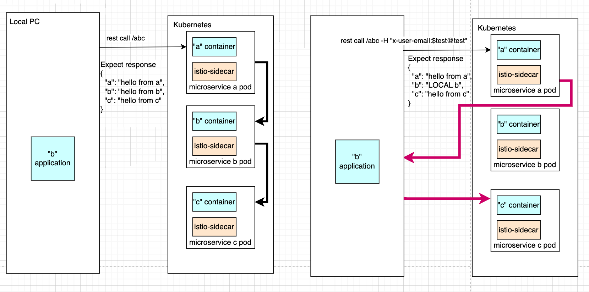

# DCloud (Dev Cloud)

## Project functionality
Start microservice(s) on localhost when all others are in Kubernetes(communication via Istio service mesh)

### Microservices:
- a (routes  /a /ab /abc)
- b (routes  /b /bc )
- c (routes  /c )

### Routes explained based on microservice 'a'
- /a  -> response data directly from microservice 'a'</br>
```json
{ "a": "hello from a" }
```
- /ab -> also call 'b' via route /b, json response from 'b' merged with our data </br>
```json
{ "a": "hello from a", "b": "hello from b" }
```
- /abc -> also call 'b' via route /bc, response from 'b' merged with our data('b' call 'c' /c and merge response) </br>
```json
{ "a": "hello from a", "b": "hello from b", "c": "hello from c" }
```

### Goal
- 'a' 'b' 'c' in kubernetes and also 'b' on localhost
- by default request send to 'http://a:8080/abc' -> 'a' call b (http://b:8080/bc) -> 'b' call c (http://c:8080/c)
- with dcloud we are able
  - receive requests from kubernetes on localhost
  - send requests from localhost to kubernetes via istio service names to any istio service
  - application that we start on localhost don't affect default istio routing
  - istio route traffic to locally launched application only when x-user-email(can easy be changed) request header condition meet




## Local Development

### Local Demo
[prepare demo infra](README_local_demo_infra.md)

## DCloud in action(based on demo infra)

### Required environment variables
- `DCLOUD_PUBLIC_KEY` 
  - simple example for default key
  - `export DCLOUD_PUBLIC_KEY=$(cat ~/.ssh/id_rsa.pub)`
- `DCLOUD_USER_EMAIL`
  - code sample  
  - `export DCLOUD_USER_EMAIL="youremail@gmail.com"`

### Build docker images
- ```cd images/bastion-egress-proxy && docker build -t bastion-egress-proxy . && cd ../..```
- ```export DOCKER_PLATFORM=$(uname -m | sed -e 's/arm64/arm64/;t' -e 's/aarch64/arm64/;t' -e 's/.*/amd64/')```
- ```cd images/bastion-ingress-proxy && docker build --build-arg DOCKER_PLATFORM=$DOCKER_PLATFORM -t bastion-ingress-proxy . && cd ../..```

### Setup DCloud infra 
- `python scripts/init.py`

### /etc/hosts update
- /etc/hosts should be enriched with istio services to be routed on localhost ( this is more simple than use Dnsmasq, anyway sudo required )
- [retrieve list of istio registered services](scripts/istio_services_list.sh)
- execute ```sudo vi /etc/hosts``` and add script result output

### Register localhost microservice
- open [microservice b source code](microservice/b/app/run.py)
- change ["hello from b"](microservice/b/app/run.py#L10) to "LOCAL b"
- change [8080](microservice/b/app/run.py#L27) to 18080
- start locally microservice 'b'
  - `pip install --trusted-host pypi.python.org -r microservice/b/requirements.txt`
  - `python microservice/b/app/run.py` 
- `python scripts/register.py b` (where `b` is istio registered microservice)
- that's all, upper script register microservice 'b' running on local and we can validate all flow

### Validate all work
First check that default work as is in cloud
- `kubectl exec -it $(kubectl get pods --no-headers -o custom-columns=":metadata.name" | grep curl-test) -c curl-test /bin/sh`
- check responses for 2 urls
- `curl http://a:8080/abc` 
- expected response 
```json
{ 
  "a": "hello from a", 
  "b": "hello from b", 
  "c": "hello from c"
}
```
- `curl http://a:8080/abc -H "x-user-email:youremail@gmail.com"`
- expected response
```json
{ 
  "a": "hello from a", 
  "b": "LOCAL b", 
  "c": "hello from c"
}
```
This validate all flow

## Technical details doc
[internal details](README_internal_details.md)
