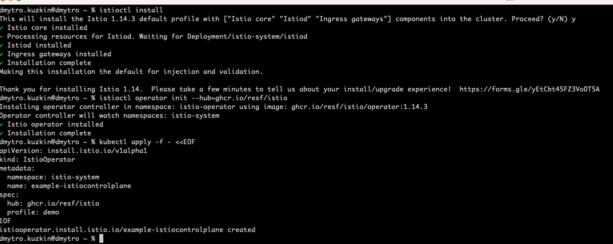
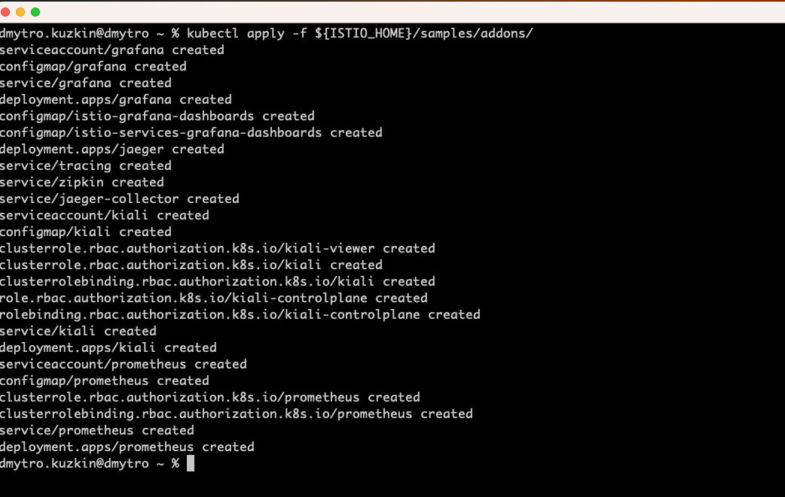

### Demo assumptions
- localhost development only
- docker
- docker enabled kubernetes
- kubectl connected to local kubernetes
- images build in demo are immediately accessible to kubernetes without any extra tag and push

### Istio setup
- [install istioctl](https://istio.io/latest/docs/setup/getting-started/)
- ```istioctl install``` ( I got docker pull issue from local docker desktop kubernetes, describe failed pod and pull image manually )
- ```istioctl operator init --hub=ghcr.io/resf/istio```
- ```
  kubectl apply -f - <<EOF
  apiVersion: install.istio.io/v1alpha1
  kind: IstioOperator
  metadata:
    namespace: istio-system
    name: example-istiocontrolplane
  spec:
    hub: ghcr.io/resf/istio
    profile: demo
  EOF
- 
- ```kubectl apply -f ${ISTIO_HOME}/samples/addons/```
- 
- [troubleshooting historical issue link, may be not relevant now](https://stackoverflow.com/questions/72073613/istio-installation-failed-apple-silicon-m1)


### Build demo application docker images
- ```cd microservice/a && docker build -t a . && cd ../..```
- ```cd microservice/b && docker build -t b . && cd ../..```
- ```cd microservice/c && docker build -t c . && cd ../..```

### Deploy demo applications into cloud
- ```kubectl apply -f deployment/kubernetes/applications/a/```
- ```kubectl apply -f deployment/kubernetes/applications/b/```
- ```kubectl apply -f deployment/kubernetes/applications/c/```

### simple validate demo state
- ```kubectl apply -f deployment/kubernetes/utils```
- ```kubectl exec -it $(kubectl get pods --no-headers -o custom-columns=":metadata.name" | grep curl-test) -c curl-test curl http://a:8080/abc```
- expected response 
```json
{ 
  "a": "hello from a", 
  "b": "hello from b", 
  "c": "hello from c"
}
```
- at this point we launch demo apps in cloud and they are able to communicate with each other via registered istio service mesh names
- next go to [original README DCloud in action](README.md#dcloud-in-actionbased-on-demo-infra)
